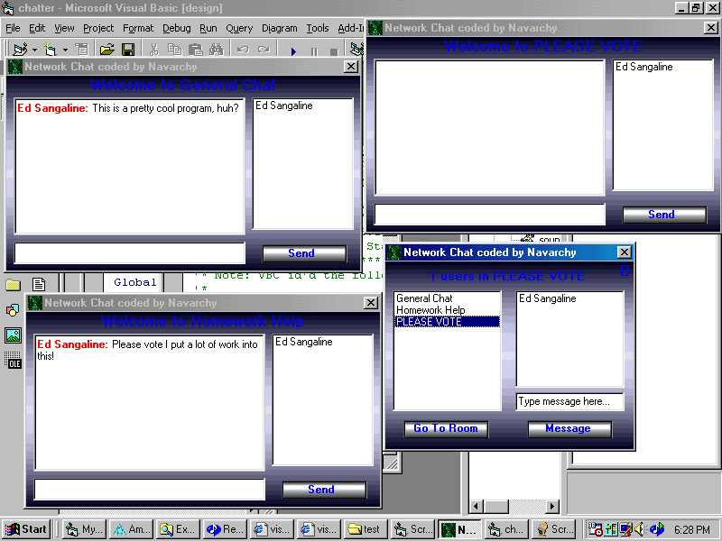



## Network Chat w/o mswinsck\.ocx

### Description

This is a great chat program. It has many features such as background options, private messaging(only on NT(, ten chat windows, the coolest shutdown sequence ever, and some really cool sound effects! Also avaliable are many administrator options. In the main chat window press alt + a and type the password "scow". This code is made for networks, but works great without one. To setup the program either place the .exe in a place that can be accessed from any computer or set the variable thefullpath equal to a place that everbody can access(more info on this in code). I put a lot of work into this so *PLEASE VOTE*
 
### More Info
 

             |
---                |---
**Submitted On**   |2001-02-06 18:21:54
**By**             |[Nave Zeng](https://github.com/Planet-Source-Code/PSCIndex/blob/master/ByAuthor/nave-zeng.md)
**Level**          |Intermediate
**User Rating**    |3.9 (27 globes from 7 users)
**Compatibility**  |VB 5\.0, VB 6\.0
**Category**       |[Complete Applications](https://github.com/Planet-Source-Code/PSCIndex/blob/master/ByCategory/complete-applications__1-27.md)
**World**          |[Visual Basic](https://github.com/Planet-Source-Code/PSCIndex/blob/master/ByWorld/visual-basic.md)
**Archive File**   |[CODE\_UPLOAD14609262001\.zip](https://github.com/Planet-Source-Code/nave-zeng-network-chat-w-o-mswinsck-ocx__1-15069/archive/master.zip)

